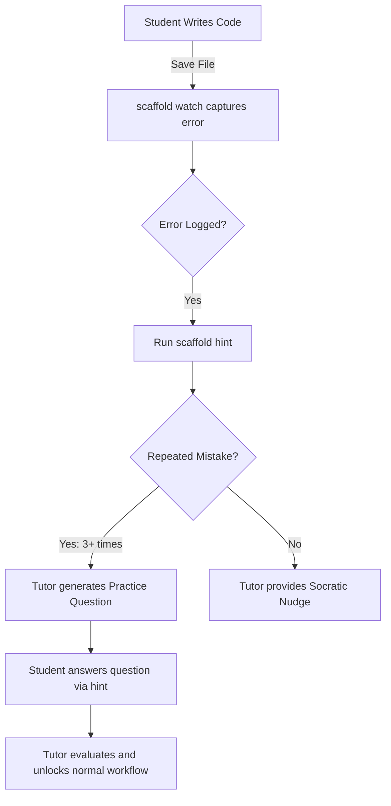

# Scaffold: The Offline Socratic AI Tutor 🚀

[](https://ollama.ai)
[](https://huggingface.co/google/gemma-2-2b)
[](https://github.com/openai/whisper)
[](LICENSE)

> **Built for the Gemma for Good Hackathon**

Scaffold is a privacy-first, fully local programming tutor for students. Traditional AI coding assistants and chatbots write code *for* students, robbing them of the learning process. Scaffold takes a different approach: it acts exactly like a human Teaching Assistant. It watches your code, catches errors instantly, and guides you to the right answer using **Socratic nudges** without ever writing the code for you.

Because Scaffold runs **100% locally**, it is perfect for college computer labs, offline classrooms, and privacy-conscious students.

---

## 🌟 Key Features

*   **⚡ Socratic Nudges (`scaffold hint`):** Instead of handing out solutions, Scaffold analyzes your code and last error to guide you step-by-step.
*   **🔄 Real-time Error Watcher (`scaffold watch`):** A background file watcher that automatically captures compiler/runtime errors on file save.
*   **🎯 Adaptive Practice Questions:** Automatically detects repeated mistakes (3+ times) on a specific programming concept and generates custom practice questions.
*   **🎤 Voice Input (`scaffold ask-voice`):** Talk directly to your tutor using your microphone to explain your confusion.
*   **👁️ Visual Debugging (`scaffold explain-image`):** Upload or capture clipboard snips of diagrams, error outputs, or IDE interfaces for visual analysis.

---

## 🛠️ The Student Workflow



---

## 🏗️ Technical Architecture

Scaffold is optimized to run efficiently on standard consumer hardware (e.g., 8GB RAM, modern multi-core CPU) without requiring dedicated GPUs:

*   **Language & Reasoning:** Local `gemma2:2b` via Ollama for ultra-fast, offline inference.
*   **Vision Engine:** Local `llava:latest` via Ollama for image/clipboard processing.
*   **Speech-to-Text:** Local OpenAI Whisper (`base` model running locally on CPU).
*   **CLI UX:** Structured via **`click`** with rich formatting, syntax highlighting, and panel displays managed by **`rich`**.

---

## 🚀 Installation & Setup

### Prerequisites
- Python 3.10 or higher
- [Git](https://git-scm.com/)

### Quick Start (Windows & macOS/Linux)

1.  **Clone the Repository:**
    ```bash
    git clone https://github.com/geekyfromgreek/Scaffold.git
    cd Scaffold
    ```

2.  **Install the Package:**
    ```bash
    pip install -e .
    ```

3.  **Run Automated Setup:**
    This command automatically installs Ollama, pulls the necessary local models (`gemma2:2b` & `llava`), and checks your audio dependencies:
    ```bash
    scaffold setup
    ```

> [!NOTE]
> **Linux/Ubuntu Users:** You must install system-level audio dependencies before running the setup:
> ```bash
> sudo apt update && sudo apt install ffmpeg
> ```

---

## 📖 Command Reference

| Command | Usage Example | Description |
| :--- | :--- | :--- |
| **`scaffold setup`** | `scaffold setup` | Downloads Ollama, pulls models, and runs hardware diagnostic tests. |
| **`scaffold watch`** | `scaffold watch` | Starts the background compiler/execution watcher in the current directory. |
| **`scaffold hint`** | `scaffold hint` | Shows a Socratic hint for the last error. Evaluates active practice question if one is pending. |
| **`scaffold answer`** | `scaffold answer "What is a pointer?"` | Launches a general Q&A prompt to ask conceptual programming questions. |
| **`scaffold ask-voice`** | `scaffold ask-voice` | Records your mic for 10 seconds and explains your question. |
| **`scaffold check`** | `scaffold check main.py --expected "Hello World"` | Compares program output with expected output, explaining logic bugs. |
| **`scaffold run`** | `scaffold run main.py` | Runs the target script, capturing outputs or compilation failures. |
| **`scaffold explain`** | `scaffold explain main.py` | Explains the target file line-by-line using high-level concepts. |
| **`scaffold explain-image`** | `scaffold explain-image --snip` | Captures your clipboard image snip and explains the visual issue. |
| **`scaffold review`** | `scaffold review main.py` | Performs a code quality review, outputting issues and Socratic hints. |
| **`scaffold review`** | `scaffold review main.py --efficiency` | Analyzes code complexity and provides Big-O optimization feedback. |
